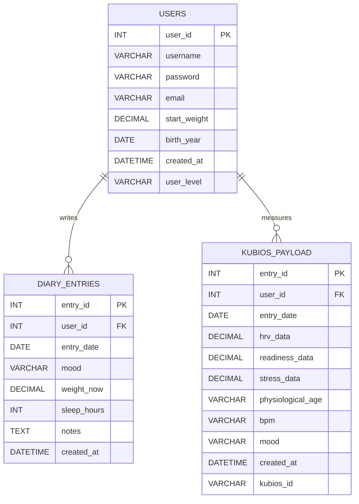

Better Training App

Better Training App on web-sovellus, joka auttaa käyttäjää seuraamaan kehon palautumista ja harjoituskuormitusta sykevälivaihtelun (HRV) avulla. Sovellus hyödyntää Kubios HRV -sovelluksella mitattua dataa ja hakee analyysit Kubios Cloud -pilvipalvelusta. Käyttäjä voi tarkastella mittaushistoriaa, seurata kehitystä sekä tehdä päiväkirjamerkintöjä. Sovelluksen tavoitteena on optimoida harjoittelua ja parantaa suorituskykyä mitatun datan avulla.

Keskeiset ominaisuudet:

- HRV-datan seuranta ja analysointi
- Automaattiset trendit ja palautumisen arviointi
- Päiväkirja harjoittelun ja hyvinvoinnin kirjaamiseen
- Harjoitussuositukset datan perusteella
- Mahdollisuus jakaa tietoja ammattilaisille (esim. valmentajalle tai lääkärille)

Linkki sovellukseen 
- #tähän linkki

Linkki sovelluksen rautalankamalliin
- https://www.figma.com/make/6pFLq7NPH3mu0e3sYubO37/HRV-Data-Analysis-App?t=0ktJrJ4etgj82vnG-1

Sovelluksen tietokanta

KISSAELÄIN
https://mikapoikonen.github.io/bettertrainingapp/
