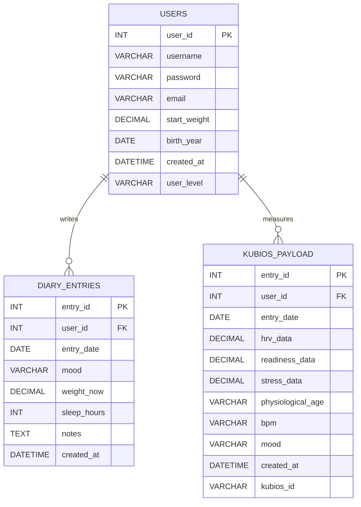

Better Training App

Better Training App on web-sovellus, joka auttaa käyttäjää seuraamaan kehon palautumista ja harjoituskuormitusta sykevälivaihtelun (HRV) avulla. Sovellus hyödyntää Kubios HRV -sovelluksella mitattua dataa ja hakee analyysit Kubios Cloud -pilvipalvelusta. Käyttäjä voi tarkastella mittaushistoriaa, seurata kehitystä sekä tehdä päiväkirjamerkintöjä. Sovelluksen tavoitteena on optimoida harjoittelua ja parantaa suorituskykyä mitatun datan avulla.
----------------------------------------------------

Sovelluksen käyttöliittymä

-----------------------------------------
Keskeiset ominaisuudet:

- HRV-datan seuranta ja analysointi
- Automaattiset trendit ja palautumisen arviointi
- Päiväkirja harjoittelun ja hyvinvoinnin kirjaamiseen
- Harjoitussuositukset datan perusteella
- Mahdollisuus jakaa tietoja ammattilaisille (esim. valmentajalle tai lääkärille)
---------------------------------------
Linkki sovellukseen 
- bettertrainingapp.switzerlandnorth.cloudapp.azure.com
---------------------------------------
Linkki sovelluksen rautalankamalliin
- https://www.figma.com/make/6pFLq7NPH3mu0e3sYubO37/HRV-Data-Analysis-App?t=0ktJrJ4etgj82vnG-1
--------------------------------------
Linkki sovelluksen automaatiotestauksen outputs-kansioon
- https://github.com/MikaPoikonen/bettertrainingapp/tree/main/outputs
--------------------------------------
Sovelluksen tietokanta

--------------------------------------
Sovelluksen Api-dokumentaatio

Listaus api toiminnoista
GET Pyynnöt
GET/users/:ID
GET/entries/:ID
GET/entries/latest/:ID
GET/kubios/user-data
GET/kubios/sql/:ID
GET pyynnöt tarvitsevat käyttäjän ID:n

POST Pyynnöt
POST/users
POST/users/login
POST/entries
POST/kubios/sql
POST pyynnöt tarvitsevat käyttäjä tai päiväkirjamerkintään tarvittavat tiedot, 
login pyyntö tarvitsee käyttäjänimen ja salasanan

PUT Pyynnöt
PUT/users/:ID
PUT/entries/:ID
PUT pyynnöt tarvitsevat id:n ja tiedot joita haluat muokata

DELETE Pyynnöt
DELETE/users/:ID
DELETE/entries
Päiväkirja merkinnän poistossa tarvitsee käyttäjän ja merkinnän id:t

Esimerkki vastauksia
POST user json vastaus
 res.status(201).json({ message: "new user added", user_id: newUserId });

POST login json vastaus
return res.json({ message: "login ok", user, token });

Esimerkkikutsuja
GET user by id
GET {{apiurl}}/users/19
Authorization: Bearer {{token}}

POST user
POST {{apiurl}}/users
Content-Type: application/json

{
    "username": "logintesti",
    "password": "Salasana123",
    "email": "login@testi.fi",
    "start_weight": 90,
    "birth_year": "2000-02-02"
}

########### User logIn
POST {{apiurl}}/users/login
Content-Type: application/json

{
  "username": "",
  "password": ""
}

PUT user
PUT {{apiurl}}/users/17
Content-Type: application/json

{
"username": "muutettu",
"password": "Salasana123",
"email": "muutettu@muutettu11.fi",
"start_weight": 90,
"birth_year": "2000-02-02"
} 

Delete user by id
DELETE {{apiurl}}/users/3
----------------------------------------
AI:n hyödyntäminen projektissa

Projektissa on hyödynnetty tekoälyä ohjelmoinnin tukena. Tekoälyä käytettiin esimerkiksi:
- virheiden etsimisen tukemiseen ja selittämiseen tarvittaessa miksi esim. koodi meni rikki. yksittäisiä parametrejä tai undefinied / null ongelmia
- erilaisten css ulkoasujen suunnitteluun. Mitä vaihtoehtoja olisi käyttää tai saada esim laatikoille hyvät shadow.
- Azure serverin pystyttämisessä. Matin ohjeissa olevaa linux serveriä esim ei ollut enää. Lisäksi tuli ongelmia regionin kanssa että pystyi käyttämään esim halvinta 8 dollarin serveriä joka oli nyt 2 luokan alla.
- Tekoäly ei tuottanut valmista projektia kokonaan, vaan sitä käytettiin oppimisen tukena ja yksittäisten ongelmien pienten osien ratkaisemiseen.
- Lisäksi AI:n käyttöä merkitty erikseen kommentteihin ja sillä on luotu myös sovelluksen logo.

------------------------------------------------
Referenssit ja kirjastot:

- https://www.w3schools.com/
- https://www.amcharts.com/demos/gauge-with-bands/
- https://www.amcharts.com/demos/control-chart/
- Oppimisessa on käytettu Ulla Söderlöf ja Matti Peltoniemi Githubin opetusmateriaalia niin fron-endissä kuin back-endissä.
- Oppimateriaalia on osittain käytetty suoraan apuna ja myös muokattu projektiin sopivaksi

KISSAELÄIN
https://mikapoikonen.github.io/bettertrainingapp/
